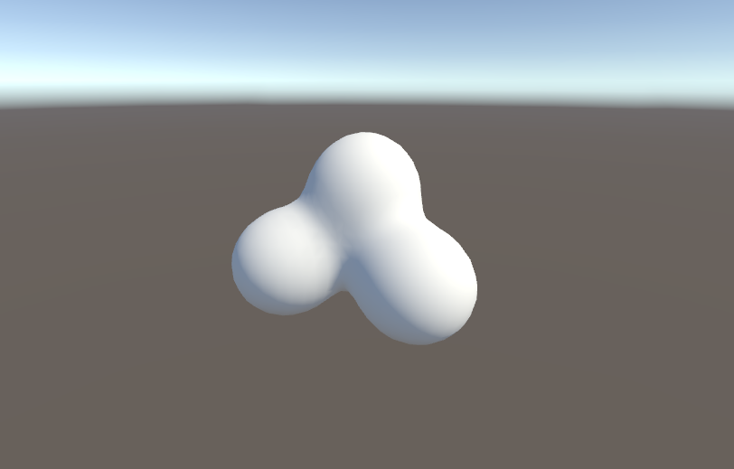

## Assignment №2: "Marching Cubes"

1. MetaBallField.cs contains a scalar function in 3d space *f = (sum of (R/distanceToPoint^2)) - 1* from a few points scattered randomly. (A.K.A [metaballs](https://en.wikipedia.org/wiki/Metaballs)).
2. Change MeshGenerator.cs in such a way, that it creates a surface of f(x, y, z) = 0 using marching cubes algorithm. Use both vertex position interpolation and normal approximation to get a soft surface.
3. For your convenience, the tables for triangleCount and triangleEdges are located in a class `MarchingCubes.Tables`.
4. Everything is setup for you in `Scenes\MarchingCubes (Press play!)`
5. Send me a screenshot of your results at mischapanin@gmail.com along with your code (best as a link to a file in your repository, but pastebin will work).
6. The e-mail should have the following topic: __HSE.CG.<your_name>.<your_last_name>.HW2__

### Bonus points:
You can get an **extra 20% bonus** if you calculate F and generate the vertices on GPU using a compute shader.   
You will get an **extra 10% bonus** if you do that using some sort of sparce structure like Spatial Hash Grid to only do that for cubes with potentially active vertices.

An example of a compute shader can be found [here](https://www.reddit.com/r/Unity3D/comments/7pa6bq/drawing_mandelbrot_fractal_using_gpu_compute/).    
A small tip: it would probably be convenient to output the results as an [AppendStruturedBuffer](https://docs.unity3d.com/ScriptReference/ComputeBufferType.Append.html) of triangle structs.

We most likely won't get to talk about compute shaders in our cource, so this is probably the best time to try them out.
