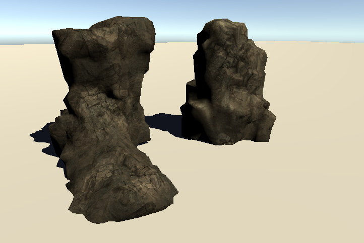

## Assignment №3: "Triplanar Projection"

1. Open Scene `Scene\Stones`
2. Implement triplanar projection in vertex and fragment shader of `Scripts\SimpleProjectionShader.shader`. Project textures `_XAlbedo, _YAlbedo, _ZAlbedo` with scale `_Scale`.
3. Get result identical to 
4. Send me a screenshot of your results at mischapanin@gmail.com along with your code (best as a link to a file in your repository, but pastebin will work).
5. The e-mail should have the following topic: __HSE.CG.<your_name>.<your_last_name>.HW3__