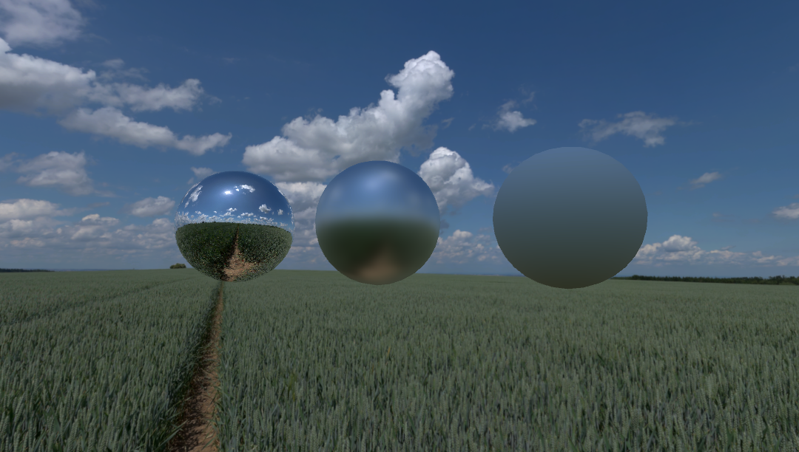

## Assignment №4: Monte-Carlo light evaluation.

0. Download hdr cubemap from [HW4](https://drive.google.com/drive/u/0/folders/1D2dP5_MNKXG1I7c0f1csIF8_rknqYRgU) into `./Assets` directory.
1. Open scene `Scenes/5_Cubemap`. You should see three reflective spheres above a grass field.
2. Edit shader `Shaders/cubemap.shader` and implement Monte-Carlo evaluation shader for a given BRDF (`GetSpecularProbability`) by normal.
3. Reproduce 
4. Send me a screenshot of your results at mischapanin@gmail.com.
5. The e-mail should have the following topic: __HSE.CG.<your_name>.<your_last_name>.HW4__

**Bonus points:** 
You can get an extra 10% bonus if you use some kind of importance sampling.

**Note:**
You don't have to make it fully realtime. Just make it somewhat interactive and keep the minimum noize from Monte-Carlo integration.
