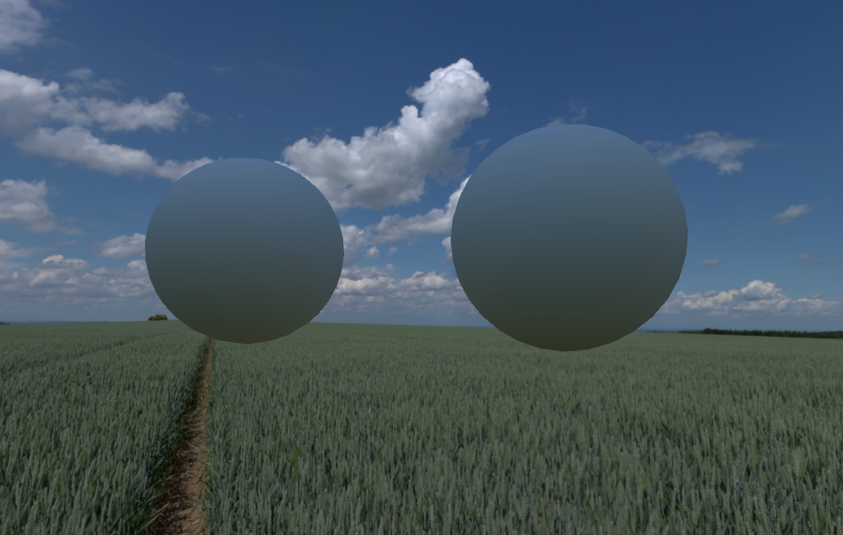

## Assignment №5: SH diffuse shader.

0. Use [previous project](../Lecture6). Set it up as described in it's readme.
1. Open `Scenes/6_SphericalHarmonics`.
2. Implement Monte-Carlo projection of that map into SH (`CubemapToSphericalHarmonic.compute::67`). Note that your calculations are only updated upon entering playmode.
3. Reproduce    
(If you didn't complete previous HW, only the left sphere should be correctly lit).
4. Check yourself using [Check My HW](./HowToCheckYourself.png) button. You should see "Everything is correct!" log. Otherwise you'll be shown the difference from correct values.
5. Send me a screenshot of your results at mischapanin@gmail.com along with your code.
5. The e-mail should have the following topic: __HSE.CG.<your_name>.<your_last_name>.HW5__

**Bonus points:**
You can get an extra 20% bonus if you implement support for some sort of brdf, allowing for various degrees of surface roughness.

**Note:**
This *is* the solution used in real games. Keep it as fast as possible.
